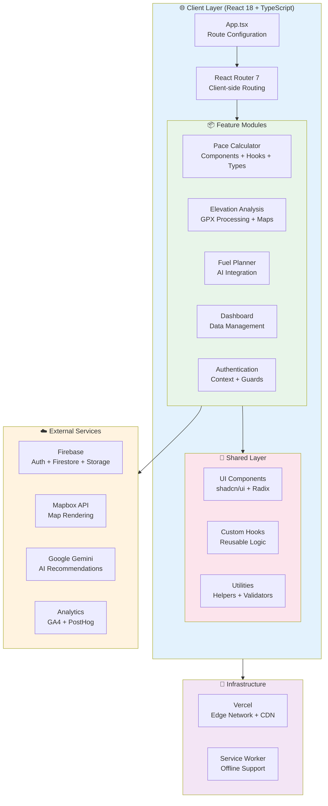

# TrainPace - Smarter Race Training & Course Analysis

[](https://vercel.com/aleexwongs-projects/trainpace)
[](https://app.codacy.com/gh/aleexwong/trainingpacecalculator2/dashboard)
[](https://www.typescriptlang.org/)
[](https://react.dev/)

**Live App**: [www.trainpace.com](https://www.trainpace.com)

TrainPace is a modern, type-safe web application designed to help runners optimize their training through intelligent pace calculation, real-world course analysis, and personalized race fueling strategies. Built with React 18, TypeScript, and Firebase, it demonstrates production-grade architecture patterns and modern web development best practices.

---

## Table of Contents

- [Core Features](#-core-features)
- [Architecture](#-architecture)
- [Technology Stack](#-technology-stack)
- [Project Structure](#-project-structure)
- [Development](#-development)
- [Testing](#-testing)
- [Programmatic SEO](#-programmatic-seo)
- [Deployment](#-deployment)
- [Design Philosophy](#-design-philosophy)

---

## 🏃 Core Features

### 📊 Training Pace Calculator

Calculate science-backed training paces from any race result:

- **Instant Pace Zones**: Get Easy, Tempo, Maximum, Speed, and Extra Long run paces
- **Flexible Units**: Switch between kilometers and miles seamlessly
- **Yasso 800s**: Automatically calculate interval training paces
- **Race Predictor**: Project performance across different distances
- **One-Click Presets**: Quick access to common race distances (5K, 10K, Half, Marathon)
- **Plan Persistence**: Save and manage multiple training plans in your dashboard

### 🎯 VDOT Calculator

Jack Daniels' VDOT scoring with an interactive dashboard layout:

- **Animated Score Gauge**: Visual SVG gauge with percentile feedback
- **"What If" Explorer**: Drag a slider to see how a faster (or slower) time changes your VDOT, training paces, and predicted race times in real time
- **Smart Time Input**: Hours/minutes/seconds fields with auto-advance as you type
- **Card-Based Distance Picker**: Switch between common race distances with one click
- **Training Zones Spectrum**: Five color-coded pace zones (Easy, Marathon, Threshold, Interval, Repetition) with visual range bars
- **Race Predictions Table**: Project times across every standard distance, with a mobile-friendly card layout
- **Sample Workouts**: Zone-specific example sessions tied to your current VDOT
- **History**: Recent calculations persisted in localStorage so you can track improvements

### 🗺️ Course Elevation Analysis

Upload and analyze any GPX route file:

- **Interactive Elevation Profiles**: Visualize climbs, descents, and grade percentages using Chart.js
- **Mapbox Integration**: See your route on beautiful, interactive maps
- **Detailed Metrics**: Total distance, elevation gain, grade analysis
- **Difficulty Scoring**: Algorithmic terrain difficulty assessment
- **Bookmark & Save**: Store favorite routes for future reference with Firebase Firestore

### 🥤 Race Fuel Planner

Science-based nutrition calculator for race day:

- **Personalized Recommendations**: Carb and calorie targets based on your pace and weight
- **AI-Powered Suggestions**: Google Gemini integration for contextual nutrition advice
- **Hourly Breakdown**: Know exactly when to fuel during your race
- **Multiple Fuel Sources**: Track gels, chews, drinks, and solid foods
- **Export Support**: Take your nutrition plan anywhere

### 📈 Personal Dashboard

Track and manage your training data:

- **Route Library**: All your uploaded GPX files in one place
- **Training Plans**: Manage saved pace calculations
- **Fuel Plans**: Access saved nutrition strategies
- **Interactive Previews**: Thumbnail maps and stats for each route
- **Unified Search**: Filter across routes, fuel plans, and pace plans from a single bar
- **Firebase Sync**: Seamless cross-device data access

### 🎨 Race Poster Generator

Premium feature for turning a route into a frame-worthy print:

- **Mapbox-Powered Renders**: Stylized route artwork generated with Mapbox GL
- **Custom Layouts**: Title, distance, elevation, and date metadata baked into the design
- **Canvas Export**: Download high-resolution PNGs ready for printing
- **GPX-Driven**: Build a poster from any uploaded route in your dashboard

### 🏁 World Major Race Previews

Hand-curated previews for iconic races:

- **8 Marathons**: Boston, NYC, Chicago, Berlin, London, Tokyo, Sydney, and Oslo
- **Course Insights**: Elevation profile, terrain commentary, and tactical tips
- **Interactive Maps**: 3D route exploration with elevation context
- **Race FAQs**: Answers to the questions runners actually ask before race day

### 📝 Running Blog

A growing library of long-form running content:

- **10+ Articles**: Training, nutrition, race strategy, gear, recovery, and beginner/advanced topics
- **Markdown-Powered**: Posts authored in markdown with cover images and reading-time estimates
- **Featured Posts**: Curated picks surfaced on the blog landing page
- **Category Filtering**: Browse by topic across seven categories

---

## 🏗 Architecture

TrainPace follows a feature-based architecture pattern with clear separation of concerns, making it maintainable and scalable.

### System Architecture Diagram


```mermaid
graph TB
    subgraph Client["🌐 Client Layer (React 18 + TypeScript)"]
        App[App.tsx<br/>Route Configuration]
        Router[React Router 7<br/>Client-side Routing]

        subgraph Features["📦 Feature Modules"]
            PaceCalc[Pace Calculator<br/>Components + Hooks + Types]
            Elevation[Elevation Analysis<br/>GPX Processing + Maps]
            Fuel[Fuel Planner<br/>AI Integration]
            Dashboard[Dashboard<br/>Data Management]
            Auth[Authentication<br/>Context + Guards]
        end

        subgraph Shared["🔧 Shared Layer"]
            Components[UI Components<br/>shadcn/ui + Radix]
            Hooks[Custom Hooks<br/>Reusable Logic]
            Utils[Utilities<br/>Helpers + Validators]
        end
    end

    subgraph Services["☁️ External Services"]
        Firebase[Firebase<br/>Auth + Firestore + Storage]
        Mapbox[Mapbox API<br/>Map Rendering]
        Gemini[Google Gemini<br/>AI Recommendations]
        Analytics[Analytics<br/>GA4 + PostHog]
    end

    subgraph Infrastructure["🚀 Infrastructure"]
        Vercel[Vercel<br/>Edge Network + CDN]
        PWA[Service Worker<br/>Offline Support]
    end

    App --> Router
    Router --> Features
    Features --> Shared
    Features --> Services
    Client --> Infrastructure

    style Client fill:#e3f2fd
    style Services fill:#fff3e0
    style Infrastructure fill:#f3e5f5
    style Features fill:#e8f5e9
    style Shared fill:#fce4ec
```

### Feature Module Structure

Each feature follows a consistent internal structure:

```
features/[feature-name]/
├── components/          # Feature-specific UI components
│   ├── [Feature]Form.tsx
│   ├── [Feature]Results.tsx
│   └── index.ts
├── hooks/              # Feature-specific custom hooks
│   ├── use[Feature]Data.ts
│   ├── use[Feature]Persistence.ts
│   └── index.ts
├── types.ts            # TypeScript interfaces/types
├── utils.ts            # Feature-specific utilities
└── index.ts            # Public API exports
```

**Benefits of this architecture:**
- **Encapsulation**: Each feature is self-contained with its own components, hooks, and types
- **Scalability**: New features can be added without modifying existing code
- **Testability**: Features can be tested in isolation
- **Code Splitting**: Features can be lazy-loaded for optimal performance
- **Developer Experience**: Clear file organization makes navigation intuitive

### Key Architectural Patterns

- **Context + Hooks**: Global state (auth) managed via React Context, consumed through custom hooks
- **Compound Components**: Complex features built with composable sub-components
- **Custom Hooks**: Business logic separated from UI components for reusability and testing
- **Type-Safe Forms**: Zod schema validation + React Hook Form for runtime safety

---

## 🚀 Technology Stack

### Frontend Core

| Technology | Version | Purpose |
|------------|---------|---------|
| **React** | 18.3 | UI library with concurrent features |
| **TypeScript** | 5.6 | Type safety and enhanced DX |
| **Vite** | 5.4 | Fast dev server, optimized builds |
| **React Router** | 7.5 | Client-side routing with data APIs |

### UI & Styling

| Technology | Purpose |
|------------|---------|
| **Tailwind CSS** | Utility-first styling with custom design tokens |
| **shadcn/ui** | Accessible, composable component primitives |
| **Radix UI** | Unstyled, accessible component library |
| **Lucide React** | Modern icon system |
| **class-variance-authority** | Type-safe component variants |

### Data Visualization & Maps

| Technology | Purpose |
|------------|---------|
| **Chart.js** | Elevation profile charts |
| **React Chart.js 2** | React wrapper for Chart.js |
| **Leaflet** | Lightweight map library |
| **Mapbox GL** | Advanced map rendering and tiles |

### Backend & Services

| Technology | Purpose |
|------------|---------|
| **Firebase Auth** | Google OAuth authentication |
| **Firestore** | NoSQL database for user data |
| **Firebase Storage** | GPX file storage |
| **Google Gemini** | AI-powered nutrition recommendations |

### Developer Experience

| Technology | Purpose |
|------------|---------|
| **ESLint** | Code linting and style enforcement |
| **TypeScript ESLint** | TypeScript-specific linting rules |
| **Zod** | Runtime type validation for forms |
| **React Hook Form** | Performant form state management |

### Analytics & Monitoring

| Technology | Purpose |
|------------|---------|
| **Google Analytics 4** | User behavior tracking |
| **PostHog** | Product analytics and feature flags |

### Progressive Web App

| Technology | Purpose |
|------------|---------|
| **vite-plugin-pwa** | PWA manifest generation |
| **Workbox** | Service worker strategies |
| **Web Manifest** | Install prompt and app metadata |

---

## 📁 Project Structure

```
trainpace/
├── vite-project/                 # Main application
│   ├── src/
│   │   ├── features/            # Feature modules (domain-driven)
│   │   │   ├── auth/           # Authentication + guards
│   │   │   │   ├── AuthContext.tsx
│   │   │   │   ├── AuthGuard.tsx
│   │   │   │   └── LoginButton.tsx
│   │   │   ├── pace-calculator/ # Training pace calculator
│   │   │   │   ├── components/
│   │   │   │   ├── hooks/
│   │   │   │   ├── types.ts
│   │   │   │   └── index.ts
│   │   │   ├── vdot-calculator/ # Jack Daniels VDOT scoring + What-If
│   │   │   │   ├── components/  # 12 focused components incl. gauge & explorer
│   │   │   │   ├── hooks/       # useVdotCalculator + history persistence
│   │   │   │   ├── vdot-math.ts # Pure VDOT math (oxygen cost model)
│   │   │   │   └── types.ts
│   │   │   ├── elevation/       # GPX analysis & maps
│   │   │   │   ├── components/
│   │   │   │   ├── hooks/
│   │   │   │   └── types.ts
│   │   │   ├── fuel/           # Race nutrition planner
│   │   │   │   ├── components/
│   │   │   │   ├── hooks/
│   │   │   │   └── utils.ts
│   │   │   ├── poster/         # Premium race poster generator
│   │   │   │   ├── components/
│   │   │   │   ├── hooks/      # Mapbox + canvas export hooks
│   │   │   │   └── utils/
│   │   │   ├── blog/           # Markdown-driven blog
│   │   │   │   ├── components/ # BlogList, BlogPost, BlogCard
│   │   │   │   └── types.ts
│   │   │   ├── seo-pages/      # Programmatic SEO page configs (80+ pages)
│   │   │   └── dashboard/       # User data management
│   │   │       ├── components/
│   │   │       ├── hooks/
│   │   │       └── actions.ts
│   │   │
│   │   ├── components/          # Shared UI components
│   │   │   ├── ui/             # shadcn/ui primitives
│   │   │   │   ├── button.tsx
│   │   │   │   ├── card.tsx
│   │   │   │   ├── dialog.tsx
│   │   │   │   └── ...
│   │   │   ├── layout/         # Layout components
│   │   │   │   ├── MainLayout.tsx
│   │   │   │   ├── SideNav.tsx
│   │   │   │   └── Footer.tsx
│   │   │   └── utils/          # Utility components
│   │   │       ├── MapboxRoutePreview.tsx
│   │   │       └── LeafletRoutePreview.tsx
│   │   │
│   │   ├── pages/              # Route-level components (18 pages)
│   │   │   ├── TrainingPaceCalculator.tsx
│   │   │   ├── VdotCalculatorPage.tsx
│   │   │   ├── ElevationPageV2.tsx
│   │   │   ├── FuelPlannerV2.tsx
│   │   │   ├── DashboardV2.tsx
│   │   │   ├── BlogList.tsx + BlogPost.tsx
│   │   │   ├── PreviewRoute.tsx     # World major race previews
│   │   │   └── Landing.tsx
│   │   │
│   │   ├── hooks/              # Global custom hooks
│   │   │   ├── use-toast.ts
│   │   │   ├── usePosterGenerator.ts
│   │   │   └── usePending*.ts
│   │   │
│   │   ├── lib/                # Core utilities & config
│   │   │   ├── seo/            # Scalable SEO system (4,000+ lines)
│   │   │   ├── firebase.ts     # Firebase initialization
│   │   │   ├── utils.ts        # Helper functions
│   │   │   ├── gpxMetaData.ts  # GPX parsing
│   │   │   └── GoogleAnalytics.tsx
│   │   │
│   │   ├── services/           # External API integrations
│   │   │   ├── gemini.ts       # Google AI integration
│   │   │   └── gemini-auth.ts
│   │   │
│   │   ├── types/              # Global TypeScript types
│   │   ├── config/             # App configuration
│   │   │   └── routes.ts
│   │   ├── data/               # Static data & content
│   │   │   ├── blog-posts.json # Long-form blog content
│   │   │   ├── marathon-data.json
│   │   │   └── faq-data.json
│   │   │
│   │   ├── App.tsx             # Root component + routing
│   │   ├── main.tsx            # Entry point
│   │   └── vite-env.d.ts       # Vite type declarations
│   │
│   ├── e2e/                     # Playwright E2E tests
│   │   └── pages/              # Page object models
│   ├── public/                  # Static assets
│   │   ├── pwa-icons/          # PWA app icons
│   │   ├── sitemap.xml         # Auto-generated SEO sitemap
│   │   └── manifest.json       # Web app manifest
│   │
│   ├── index.html              # HTML entry point
│   ├── vite.config.ts          # Vite configuration
│   ├── tailwind.config.js      # Tailwind configuration
│   ├── tsconfig.json           # TypeScript configuration
│   └── package.json            # Dependencies & scripts
│
├── scripts/                     # Utility scripts
│   └── generate-sitemap.js     # SEO sitemap generation
│
├── README.md                    # This file
└── vercel.json                 # Vercel deployment config
```

### Key Directory Explanations

- **`features/`**: Domain-driven feature modules. Each feature is self-contained with its components, hooks, and types. This makes features easy to understand, test, and modify in isolation.

- **`components/ui/`**: shadcn/ui components. These are copied into the project (not imported from npm) allowing customization while maintaining upgrade paths.

- **`components/layout/`**: Application shell components like navigation, headers, and footers that are shared across all pages.

- **`pages/`**: Top-level route components. These are thin wrappers that compose feature modules and shared components.

- **`hooks/`**: Global custom hooks that are used across multiple features.

- **`lib/`**: Core application logic, Firebase setup, and utility functions that don't belong to any specific feature.

- **`services/`**: External API integrations and third-party service wrappers.

---

## 🛠️ Development

### Prerequisites

- **Node.js** 18+ and npm
- **Firebase project** with Firestore and Auth enabled
- **Mapbox API token** (for elevation page maps)
- **Google AI API key** (optional, for Gemini features)

### Local Setup

```bash
# Clone the repository
git clone https://github.com/aleexwong/trainingpacecalculator2.git
cd trainingpacecalculator2/vite-project

# Install dependencies
npm install

# Copy environment template
cp .env.example .env

# Add your credentials to .env
# VITE_FIREBASE_API_KEY=...
# VITE_FIREBASE_AUTH_DOMAIN=...
# VITE_FIREBASE_PROJECT_ID=...
# VITE_FIREBASE_STORAGE_BUCKET=...
# VITE_FIREBASE_MESSAGING_SENDER_ID=...
# VITE_FIREBASE_APP_ID=...
# VITE_MAPBOX_TOKEN=...

# Start development server
npm run dev
```

The app will be available at `http://localhost:5173`

### Available Scripts

```bash
npm run dev              # Start Vite dev server (localhost:5173)
npm run build            # TypeScript check + production build
npm run preview          # Preview production build locally
npm run lint             # Run ESLint checks
npm run host             # Expose dev server on local network
npm run generate-pwa-assets  # Generate PWA icons
npm run generate-sitemap # Regenerate sitemap.xml from SEO page configs
npm run test:e2e         # Run Playwright end-to-end test suite
npm run seed-boston      # Seed Boston Marathon route data
npm run test-gemini      # Test Gemini API integration
```

### Development Workflow

1. **Feature Development**: Create new features in `src/features/[feature-name]/`
2. **Component Addition**: Add shared components to `src/components/`
3. **Type Safety**: Define TypeScript interfaces in feature-level `types.ts` files
4. **State Management**: Use custom hooks for business logic, Context for global state
5. **Styling**: Use Tailwind utility classes and extend with custom components
6. **Testing**: Test components in isolation with TypeScript type checking

### Code Quality

- **TypeScript**: Strict mode enabled for maximum type safety
- **ESLint**: Enforces consistent code style and catches common errors
- **Prettier**: Code formatting (configure in your editor)
- **Zod**: Runtime validation for forms and external data

---

## 🧪 Testing

End-to-end coverage is provided by **Playwright**, with page object models living in `vite-project/e2e/pages/`.

```bash
cd vite-project
npm run test:e2e     # Run the full Playwright suite locally
```

CI runs the same suite on every push to `main` and on pull requests via `.github/workflows/e2e.yml`. The workflow caches npm dependencies, the Vite prebundle directory, and the matching Playwright browser version, then publishes a 30-day-retention HTML report as a build artifact.

---

## 🔎 Programmatic SEO

TrainPace ships with a scalable SEO system designed to support 100,000+ programmatic landing pages:

- **80+ Live SEO Pages**: Distance-, race-, and tool-specific landing pages auto-generated from a typed config
- **Static Prerendering**: Routes are baked to HTML at build time via `vite-plugin-prerender` for fast first paint and crawlability
- **JSON-LD Schemas**: `SoftwareApplication`, `FAQPage`, `HowTo`, and `BreadcrumbList` schemas generated per page
- **Internal Linking Engine**: Hub-and-spoke linking with related-page discovery
- **Automated Sitemaps**: `npm run generate-sitemap` produces a chunked sitemap that respects the 50k-URL-per-file limit
- **Validation & Pre-Publish Checks**: Every page is graded for title/description length, duplicate content, and schema completeness before shipping

Page configs live in `src/features/seo-pages/seoPages.ts` and the supporting library is split across `src/lib/seo/` (`schema-generators`, `meta-generators`, `internal-linking`, `content-generators`, `build-utils`, `validation`).

---

## 🚢 Deployment

TrainPace is deployed on **Vercel** with automatic deployments on every push to `main`.

### Deployment Features

- **Edge Network**: Global CDN for fast load times worldwide
- **Automatic HTTPS**: SSL certificates managed by Vercel
- **Preview Deployments**: Every PR gets a unique preview URL
- **Environment Variables**: Securely managed in Vercel dashboard
- **Analytics**: Built-in Web Analytics and Speed Insights

### Deploy Your Own

[](https://vercel.com/new/clone?repository-url=https://github.com/aleexwong/trainingpacecalculator2)

#### Required Environment Variables

```bash
VITE_FIREBASE_API_KEY=your_api_key
VITE_FIREBASE_AUTH_DOMAIN=your_project.firebaseapp.com
VITE_FIREBASE_PROJECT_ID=your_project_id
VITE_FIREBASE_STORAGE_BUCKET=your_project.appspot.com
VITE_FIREBASE_MESSAGING_SENDER_ID=your_sender_id
VITE_FIREBASE_APP_ID=your_app_id
VITE_MAPBOX_TOKEN=your_mapbox_token
```

### Build Configuration

The production build:
- Runs TypeScript type checking before build
- Minifies and tree-shakes JavaScript
- Optimizes CSS with PurgeCSS
- Generates service worker for offline support
- Creates optimized chunks with code splitting
- Compresses assets with gzip/brotli

---

## 🎯 Design Philosophy

- **Mobile-First**: Responsive design with touch-friendly interfaces
- **Zero Friction**: No account required for core features, instant results
- **Progressive Enhancement**: Offline-capable PWA with advanced authenticated features
- **Performance First**: Code splitting, lazy loading, optimized bundle size
- **Accessibility**: WCAG 2.1 AA compliant with keyboard and screen reader support
- **Type Safety**: TypeScript throughout with Zod runtime validation

---

## 📊 Performance Metrics

**Lighthouse Scores**: Performance 95+ | Accessibility 100 | Best Practices 100 | SEO 100 | PWA ✓

**Bundle Size**: ~180KB JS + ~12KB CSS (gzipped) | TTI <2s on 4G


---

## 📝 License

Open source for educational purposes. Feel free to learn from the code and use snippets in your own projects with attribution.

---

## 🙏 Acknowledgments

Built with [shadcn/ui](https://ui.shadcn.com/), [Mapbox](https://www.mapbox.com/), [Firebase](https://firebase.google.com/), and [Vercel](https://vercel.com/). Pace calculations based on Jack Daniels' Running Formula.

---

**Made with ❤️ for runners who take their training seriously.**

*Last Updated: Apr 2026*
